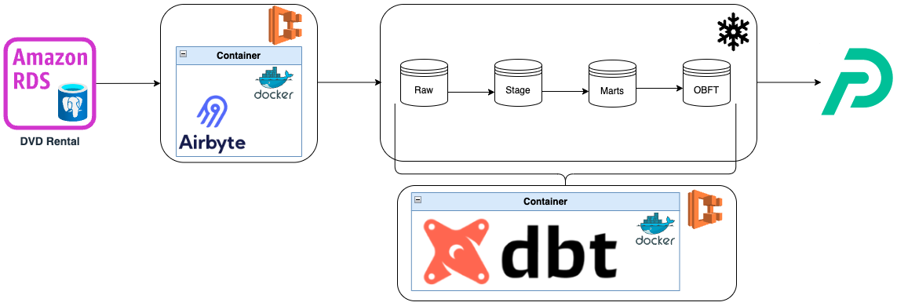
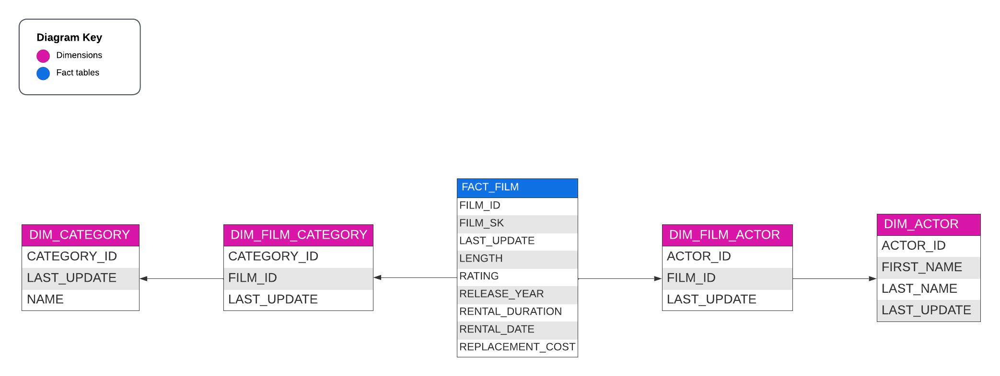
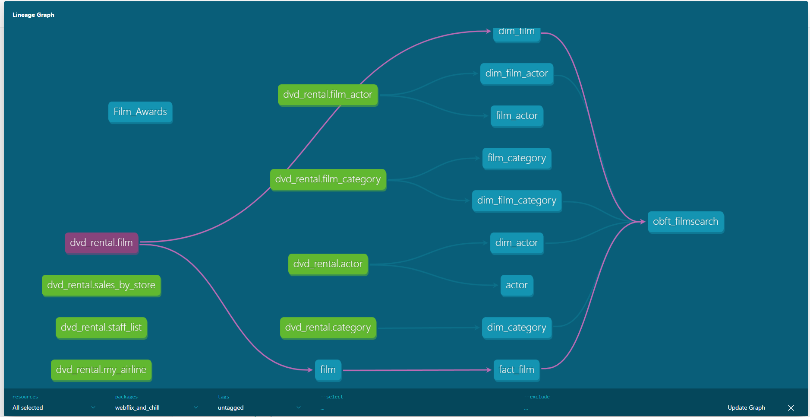

# DEC Project 2 - Group 1

## Group Members
 - Dionis Matos
 - Jake Shivers
 - Rui Correia
 - Sam Less

 ## Project Plan

 ### Data Source, Objective, Consumers & Questions
 In this project we will use the DVD Rental Database to prepare a Dashboard for:
 - Users to easily search films by actor, category and rating
 - Shop staff to follow on monthly payments by customer

The DVD Rental will be loaded in a PostgreSQL server deployed in RDS - this will be used as Data Source for the project. Diagram:


### Architecture & ETL
The architecture defined as baseline for this project is:


Please find below a high level description of each of the architecture blocks:
 - We have restored the DVD Rental DB in a PostgreSQL 14 deployed in a RDS instance in AWS - we assume this to be our original Data Source and starting Point.
 - We are using Airbyte to ingest Data (as is - no data handling) from RDS into Snowflake - in order to have the solution fully Cloud based, we Dockerize Airbyte and deploy it in a EC2 instance in AWS - Extraction.
 - Once Data is in Snowflake, we will work it through consecutive layers described below:
    - Raw: Data exactly the same as in Data Source.
    - Staging: Some data cleansing, renaming and filtering columns.
    - Marts: Business rules implemented and transformed into a Dimensional Model to feed Reporting.
    - OBFT: Since Apache Preset can only consume one single table, we join all the model into a One Big Fat Table.
 - DBT runs over Snowflake moving data between the different layers - Transformation + Load.
    - Also DBT is Dockerized and deployed in EC2.
 - Preset consumes the OBFT from Snowflake and reports / Dashboard are prepared in it

### Consumption layer
For reporting consumption, a Data Mart was created using Dimentional modeling. In this case, we used a Snowflake model since the amount of data is reasonable. In order to sclae to largar Datasets, we could easily join the two "snowflakes" into a single table each, turing the Mart into a pure Star Schema.

Data Mart ERD:


Important to notice that due to Apache Preset limitations (can only consume a single table per dataset) we had to create a final layer for Preset consumption - OBFT: One Big Fat Table with the above tables joined. If we were to use more powerful Visualization tools that con consume data models with several tables like Power BI, Tableau or Qlik, this layer would not be necessary.


### DBT tests
* testing for a value set
```bash
        tests:
          - dbt_expectations.expect_column_values_to_be_in_set:
              value_set: ["G", "PG", "PG-13", "R", "NC-17"]
```
* give a warning on data freshness:
```bash
    tables:
      - name: actor
        loaded_at_field: last_update
        freshness:
          warn_after: {count: 1, period: day}
```

### DBT Lineage Graph


### Project Management

To breakdown the tasks and assign them to each team member, we have created a Kanban in Jira:
https://dataengineerproject.atlassian.net/jira/software/projects/P2G1/boards/3

In order to track & merge code changes, as well as develop in parallel, we are using Github for the code versioning, each team member havin its own branch:
https://github.com/jakeshivers/webflix-and-chill

Since the team is divided in different timezones, we tried to work as asynchronously as possible using the Slack group to communicate and classes to meet, align status and define next steps.