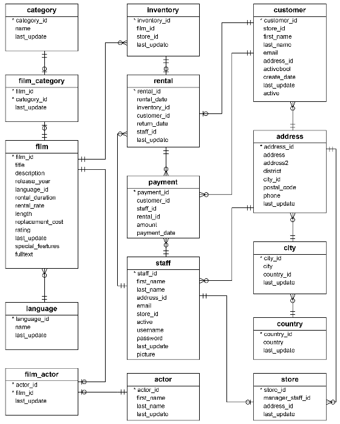

# DEC Project 2 - Group 1

## Group Members
 - Dionis Matos
 - Jake Shivers
 - Rui Correia
 - Sam Less

 ## Project Plan

 ### Data Source, Objective, Consumers & Questions
 In this project we will use the DVD Rental Database to prepare a Dashboard for:
 - Users to easily search films by actor, category and rating
 - Shop staff to follow on monthly payments by customer

The DVD Rental will be loaded in a PostgreSQL server deployed in RDS - this will be used as Data Source for the project. Diagram:

### Architecture
TBD

Architecture description: TBD

## ETL

### Extraction

### Transformation

### Load
