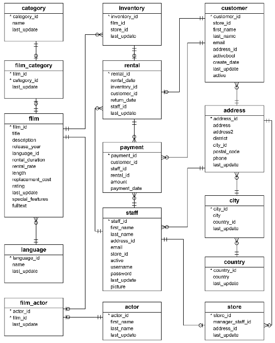

# DEC Project 2 - Group 1

## Group Members
 - Dionis Matos
 - Jake Shivers
 - Rui Correia
 - Sam Less

 ## Project Plan

 ### Data Source, Objective, Consumers & Questions
 In this project we will use the DVD Rental Database to prepare a Dashboard for:
 - Users to easily search films by actor, category and rating
 - Shop staff to follow on monthly payments by customer

The DVD Rental will be loaded in a PostgreSQL server deployed in RDS - this will be used as Data Source for the project. Diagram:

### Architecture & ETL
The architecture defined as baseline for this project is:

Please find below a high level description of each of the architecture blocks:
 - We have restored the DVD Rental DB in a PostgreSQL 14 deployed in a RDS instance in AWS - we assume this to be our original Data Source and starting Point.
 - We are using Airbyte to ingest Data (as is - no data handling) from RDS into Snowflake - in order to have the solution fully Cloud based, we Dockerize Airbyte and deploy it in a EC2 instance in AWS - Extraction.
 - Once Data is in Snowflake, we will work it through consecutive layers described below:
    - Raw: Data exactly the same as in Data Source.
    - Staging: Some data cleansing, renaming and filtering columns.
    - Marts: Business rules implemented and transformed into a Dimensional Model to feed Reporting.
    - OBFT: Since Apache Preset can only consume one single table, we join all the model into a One Big Fat Table.
 - DBT runs over Snowflake moving data between the different layers - Transformation + Load.
    - Also DBT is Dockerized and deployed in EC2.
 - Preset consumes the OBFT from Snowflake and reports / Dashboard are prepared in it

